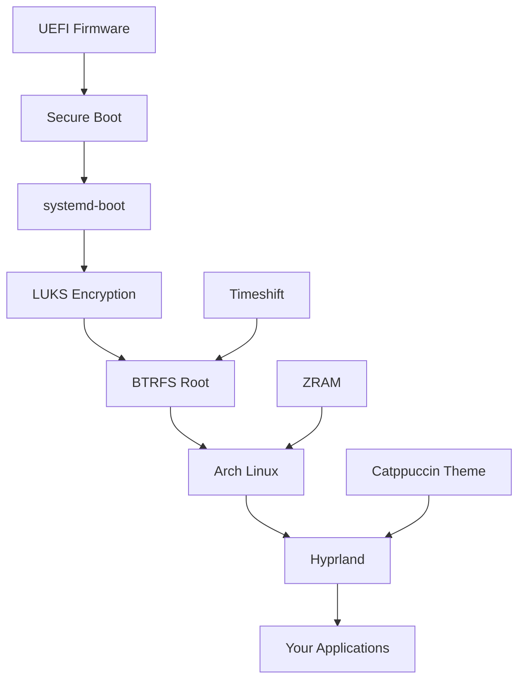

# 🏠 Arch Linux Hyprland Zero - Wiki Home

> **Your complete guide to a lightning-fast, beautiful Arch Linux setup**

Welcome to the comprehensive documentation for setting up Arch Linux with Hyprland, optimized for maximum performance with zero animations.

## 🎯 Quick Navigation

### 📚 Core Documentation
- **[Complete Installation Guide](Full-Installation-Guide)** - All steps in one place
- **[Quick Start](Quick-Start)** - For experienced users
- **[Video Tutorials](Video-Tutorials)** - Visual walkthroughs

### 🔧 Installation Steps
1. **[Pre-Installation](01-Pre-Installation)** - Preparation and requirements
2. **[Base Installation](02-Base-Installation)** - Core Arch Linux setup
3. **[Disk Setup](03-Disk-Setup)** - BTRFS, encryption, partitioning
4. **[System Configuration](04-System-Configuration)** - Users, networking, boot
5. **[Hyprland Setup](05-Hyprland-Setup)** - Window manager installation
6. **[Essential Software](06-Essential-Software)** - Must-have applications
7. **[Theming](07-Theming)** - Catppuccin/Dracula setup
8. **[Dotfiles Management](08-Dotfiles-Management)** - Chezmoi configuration
9. **[Performance Tuning](09-Performance-Tuning)** - Optimization tips
10. **[Security Hardening](10-Security-Hardening)** - Secure boot and more

### 🛠️ Advanced Topics
- **[Troubleshooting](11-Troubleshooting)** - Common issues and solutions
- **[Tips & Tricks](12-Tips-and-Tricks)** - Power user features
- **[Hardware Specific](13-Hardware-Specific)** - Laptop/Desktop optimizations
- **[Development Setup](14-Development-Setup)** - IDE and tool configuration
- **[Gaming Setup](15-Gaming-Setup)** - Steam, Lutris, and more

### 📦 Configuration Files
- **[Hyprland Config](Config-Hyprland)** - Complete hyprland.conf
- **[Waybar Config](Config-Waybar)** - Status bar configuration
- **[Alacritty Config](Config-Alacritty)** - Terminal settings
- **[Rofi Config](Config-Rofi)** - Application launcher
- **[Chezmoi Templates](Config-Chezmoi)** - Dotfile templates

### 📖 Reference
- **[Keybindings](Reference-Keybindings)** - Complete keyboard shortcuts
- **[Commands Cheatsheet](Reference-Commands)** - Useful commands
- **[Package List](Reference-Packages)** - All installed packages
- **[Theme Gallery](Reference-Themes)** - Available themes
- **[FAQ](FAQ)** - Frequently asked questions

## 🚀 Getting Started

### New to Arch Linux?
Start with **[Pre-Installation](01-Pre-Installation)** and follow each step sequentially. Each page has:
- Clear explanations of what we're doing
- Complete command examples
- Troubleshooting tips
- Links to the next step

### Experienced User?
Jump to **[Quick Start](Quick-Start)** for a condensed version, or use the **[Complete Installation Guide](Full-Installation-Guide)** as a reference.

## 💡 Philosophy

This setup is built on these principles:

### ⚡ Speed First
- Zero animations for instant feedback
- Minimal background services
- Optimized for responsiveness
- Fast boot and shutdown

### 🎨 Beautiful Simplicity
- Consistent theming (Catppuccin/Dracula)
- Clean, distraction-free interface
- Logical keybindings
- Intuitive workflows

### 🔒 Secure by Default
- Full disk encryption
- Secure Boot support
- Minimal attack surface
- Regular snapshot backups

### 🛠️ Developer Friendly
- Git-managed dotfiles
- Reproducible setup
- Well-documented configuration
- Easy customization

## 📊 System Overview

## 🤝 Community

### Get Help
- **[GitHub Issues](https://github.com/yourusername/arch-hyprland-zero/issues)** - Bug reports
- **[Discussions](https://github.com/yourusername/arch-hyprland-zero/discussions)** - Q&A
- **[Discord Server](https://discord.gg/your-server)** - Live chat

### Contribute
- Fix typos or improve documentation
- Share your configuration tweaks
- Report bugs or suggest features
- Help others in discussions

## 📝 License & Credits

This documentation is released under the MIT License. Feel free to use, modify, and share.

Special thanks to:
- The Arch Linux community
- Hyprland developers
- Theme creators (Catppuccin, Dracula)
- All contributors

---

**Ready to begin?** → **[Start with Pre-Installation](01-Pre-Installation)**

